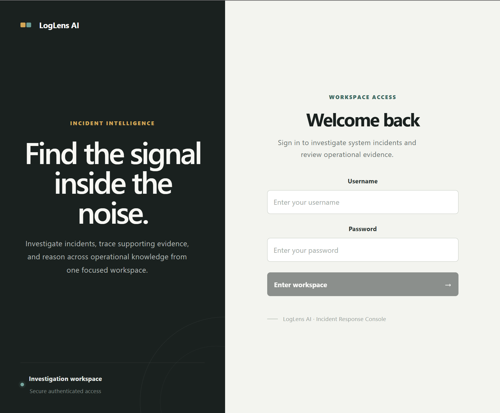

## Live Demo

[Try LogLens AI](https://loglens-ai-x44s.onrender.com/)

### Demo Accounts

| Role | Username | Password |
|---|---|---|
| Standard User | `loglens_test` | `TestPassword123!` |
| Administrator | `admin` | `LogLensDemo123!` |

The demo environment contains sample data and is intended for portfolio and recruiter testing. The administrator account demonstrates role-based access control and document-upload functionality.

**Note:** The demo is hosted on Render's free tier, so the first load may take up to a minute if the service has been inactive.
---

## Application Preview



> LogLens AI login interface. Additional application screenshots are included below.

---

## The Problem

When a technical incident occurs, engineers may need to search across logs, runbooks, documentation, and previous incident information to understand what happened.

That information can be spread across multiple files and difficult to search quickly.

I built LogLens to explore how semantic search and retrieval-augmented generation (RAG) can make technical knowledge easier to find and use during an investigation.

---

## What LogLens Does

LogLens currently supports:

- Uploading and processing technical documents
- Organizing technical information in structured storage
- Searching documents using semantic similarity
- Asking incident-related questions using RAG
- Retrieving relevant context before generating an AI-assisted response
- Showing the sources supporting generated answers
- Managing incident information through REST APIs
- Authenticating users and controlling access
- Separating standard-user and administrator functionality
- Collecting feedback on generated answers
- Tracking questions and analyzing system usage

---

## How It Works

The core workflow is:

```text
Technical Documents
        |
        v
Document Ingestion
        |
        v
Processing + Storage
        |
        +------------------+
        |                  |
        v                  v
 Structured Data     Vector Embeddings
                           |
                           v
                     Semantic Search
                           |
                           v
                    Relevant Context
                           |
                           v
                       RAG Q&A
                           |
                           v
                  Answer + Sources
                           |
                           v
                     User Feedback
```

When a user asks a question about an incident, LogLens retrieves relevant information from the available technical knowledge first. That context is then used to support the generated response.

The goal is to make the answer traceable back to the information used during the investigation rather than relying only on an LLM's general knowledge.

---

## System Architecture

```text
                         LogLens AI
                             |
                             v
                   React + TypeScript
                         Frontend
                             |
                             v
                         REST API
                             |
                             v
                      FastAPI Backend
                             |
              +--------------+--------------+
              |              |              |
              v              v              v
        Authentication   Incident Data   Documents
                                             |
                                             v
                                    Document Processing
                                             |
                                             v
                                         Embeddings
                                             |
                                             v
                                      Semantic Search
                                             |
                                             v
                                    Retrieved Context
                                             |
                                             v
                                          RAG Q&A
                                             |
                                             v
                                  Answer + Source Context
                                             |
                                             v
                                      User Feedback
```

---

## Tech Stack

| Area | Technologies |
|---|---|
| **Frontend** | React, TypeScript, Vite, CSS |
| **Backend** | Python, FastAPI, REST APIs, SQLAlchemy, Uvicorn |
| **AI / Retrieval** | RAG, Sentence Transformers, Vector Embeddings, Semantic Search, LLM Integration |
| **Data** | SQLite, PostgreSQL / pgvector support |
| **Development** | Docker, Docker Compose, Git, GitHub |
| **Configuration** | Environment-based configuration |

---

## AI Investigation

A user can select an incident and ask a question about what may have happened.

```text
User Question
      |
      v
Semantic Retrieval
      |
      v
Relevant Document Chunks
      |
      v
Context + Question
      |
      v
LLM
      |
      v
Grounded Response
      |
      v
Sources + Feedback
```

LogLens also surfaces the retrieved sources alongside the response so users can see what technical information contributed to the answer.

---

## Authentication and Access Control

LogLens includes authentication and role-based functionality.

**Standard users can:**

- View incidents
- Investigate incidents with AI
- Browse the available knowledge base
- Review supporting sources
- Submit feedback

**Administrators can additionally:**

- Upload technical documents
- Add information to the knowledge base

The public demo account is intentionally configured as a standard user.

---

## Knowledge Base

Uploaded technical documents move through a retrieval pipeline:

```text
Document
   |
   v
Content Extraction
   |
   v
Chunking
   |
   v
Embedding
   |
   v
Storage
   |
   v
Semantic Retrieval
```

When an incident question is submitted, LogLens searches this processed knowledge for relevant context before generating the response.

---

## Feedback and Analytics

I also wanted LogLens to capture what happens *after* an AI answer is generated.

Users can mark responses as **Helpful** or **Not Helpful**, and LogLens stores that feedback alongside investigation activity.

The analytics interface tracks information including:

- Total questions
- Feedback responses
- Helpful response rate
- Knowledge-base document counts
- Document chunks
- Recent questions

This gives the application a basic feedback loop instead of treating generation as the end of the workflow.

---

## Running Locally

### 1. Clone the repository

```bash
git clone https://github.com/waqara1-ui/knowledgehub-ai.git
cd knowledgehub-ai
```

### 2. Create a virtual environment

Windows:

```powershell
python -m venv venv
.\venv\Scripts\Activate.ps1
```

macOS/Linux:

```bash
python3 -m venv venv
source venv/bin/activate
```

### 3. Install backend dependencies

```bash
pip install -r requirements.txt
```

### 4. Install frontend dependencies

```bash
cd frontend
npm install
```

### 5. Configure local development

Create:

```text
frontend/.env.local
```

Add:

```env
VITE_API_URL=http://localhost:8000
```

### 6. Start the backend

From the project root:

```bash
uvicorn main:app --reload --port 8000
```

### 7. Start the frontend

In another terminal:

```bash
cd frontend
npm run dev
```

---

## Production Build

Build the React frontend with:

```bash
cd frontend
npm run build
```

The production frontend is generated in:

```text
frontend/dist
```

FastAPI serves the compiled frontend so the UI and API can run together as a single application.

---

## Project Structure

```text
knowledgehub-ai/
|
├── frontend/
|   ├── src/
|   └── dist/
|
├── sample_data/
├── uploaded_files/
|
├── main.py
├── database.py
├── models.py
├── llm.py
├── config.py
|
├── requirements.txt
├── Dockerfile
├── docker-compose.yml
└── README.md
```

---

## Why I Built LogLens

I wanted to build something that went beyond connecting an LLM to a simple interface.

LogLens gave me a way to work through the full application flow: building the frontend, designing APIs, structuring application data, implementing authentication, processing documents, experimenting with semantic retrieval and RAG, and connecting those pieces into one usable system.

It has also given me a way to explore a question I care about when building AI applications:

> **How do you make generated answers more useful when users need information grounded in their own data?**

LogLens is still evolving, and I plan to continue improving the retrieval, evaluation, and overall investigation experience.

---

## About Me

**Amina Waqar**  
Computer Science, Intelligent Systems Specialization  
University of California, Irvine

[LinkedIn](https://www.linkedin.com/in/amina-waqar-232b79376/) | [GitHub](https://github.com/waqara1-ui) | [Portfolio](https://waqara1-ui.github.io/)
